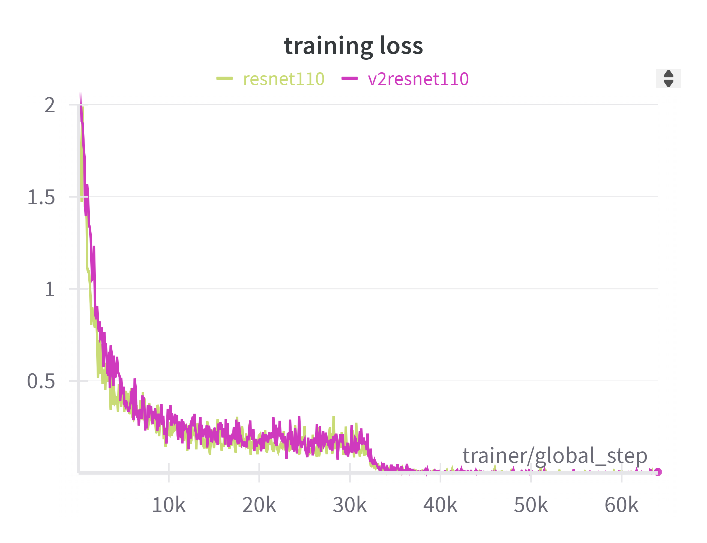
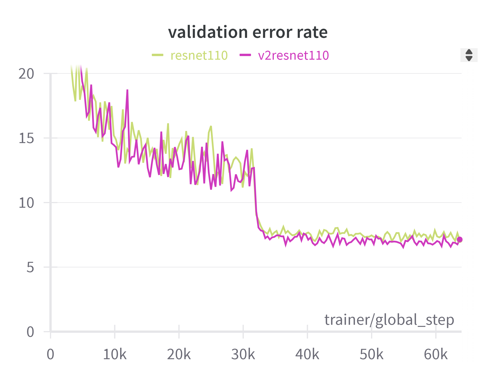
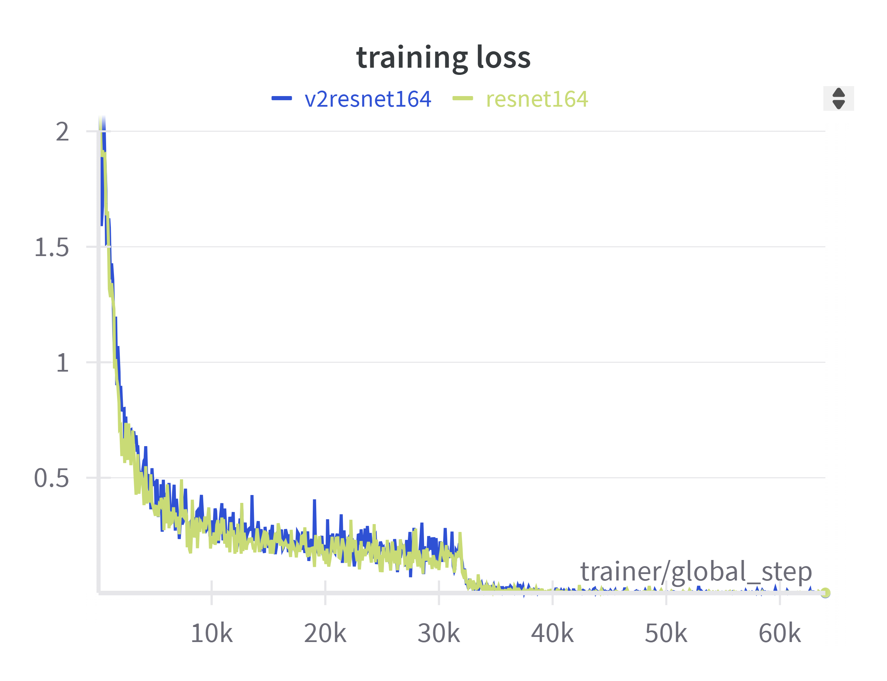
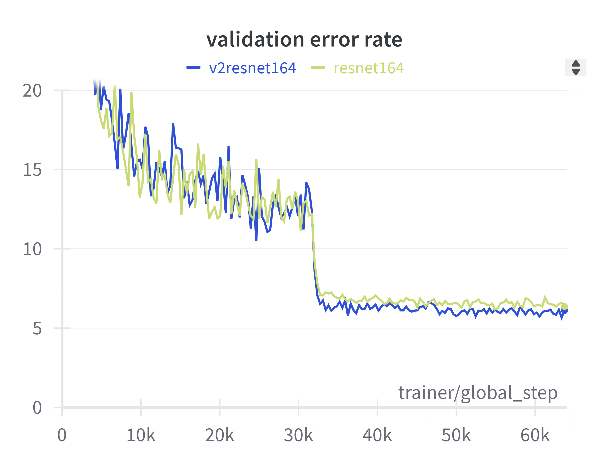

# cifar10_resnetv2
간단한 이미지 분류 모델입니다.

### Introduction

[Identity Mappings in Deep Residual Networks](https://arxiv.org/pdf/1603.05027) 논문을 읽고 resnetv2 model을 직접 구현해보았습니다.
학습 데이터셋은 cifar10을 사용했습니다.


### Requirements
After cloning the repo, run this line below:
```
pip install -r requirements.txt
```

### Usage

##### 1. train & test model
```
mkdir model
python -m cifar10_resnetv2.train -model {모델}
python -m cifar10_resnetv2.test -model {모델}
```

##### 2. statistics
| model    | # layers | # params | error(%) |
|----------|:---------|----------|----------|
| resnet   | 110      | 1.7M     | 7.86     |
| resnetV2 | 110      | 1.7M     | 7.59     |
| resnet   | 164      | 1.7M     | 6.75     |
| resnetV2 | 164      | 1.7M     | 6.57     |


##### 3. plots
- training loss(v2resnet110 & resnet110)



- testing error(v2resnet110 & resnet110)



- training loss(v2resnet164 & resnet164)



- testing error(v2resnet164 & resnet164)


